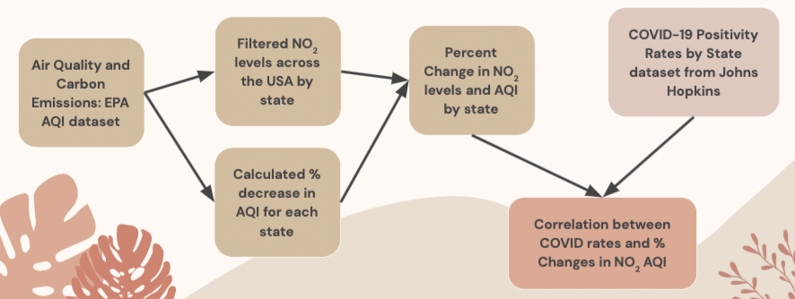
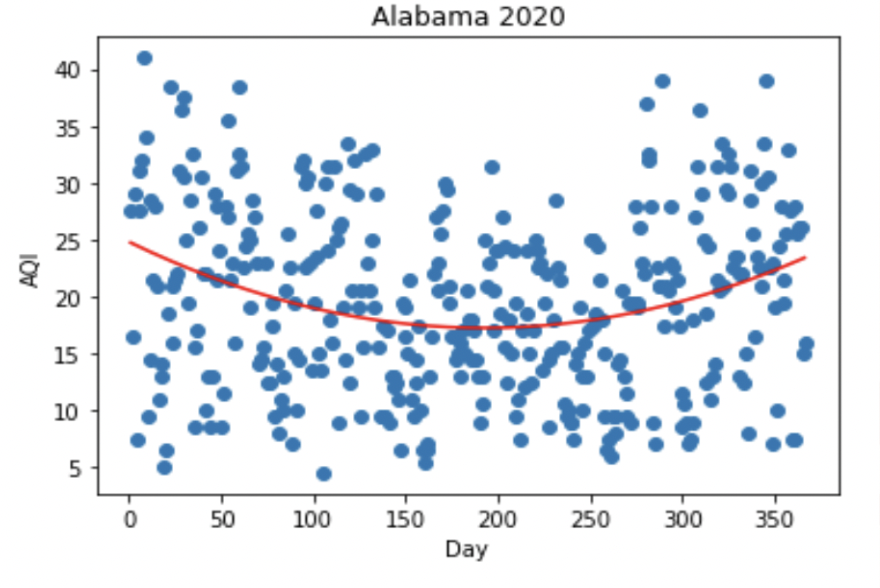

# covidAirQuality
<h2>Hypothesis</h2>
  <ol>
    <li>NO2 levels across the United State have decreased after March 2020 due to COVID-19</li>
    <li>The NO2 levels correlated with the seversity of COVID-19 in different states.</li>
    <li>The amount of change is greatest in states that are more liberal</li>
  </ol>

  <h3>Why NO2? And why a decrease?</h3>
    <ul>
      <li>NO2 is released into the atmosphere due to burning fuel</li>
      <li>Main sources
        <ul>
          <li>Car Emissions</li>
          <li>Trucks and Buses</li>
          <li>Power Plants</li>
          <li>Off-road equipmemnt</li>
        </ul>
      </li>
      <li>COVID-19's effect on transit
        <ul>
          <li>Mass quarantining => more people off the roads</li>
          <li>Remote jobs => a general decrease in vehicular usage</li>
        </ul>
      </li>
    </ul>
    <b>
    In theory, the decreased transit should cause a decrease in NO2 levels and a greater drop in the Air Quality Index across the US.
    </b>
  
  <h3>NO2 Levels & Partisanship</h3>
  <b>
  Conservative states have had looser COVID-19 restrictions compared to liberal states
  </b>
  <ul>
    <li>Looser mask/vaccine/social-distancing mandates in these states</li>
  </ul>
  <b>
  We expect that liberal states will have lower COVID positivity rates and a larger decrease in NO2 levels
  </b>

<h2>Methodology</h2>
</img>
  
<h3>Tools Used for Data Analysis</h3>
Python Libraries
<ul>
  <li>Matplotlib</li>
  <li>Pandas</li>
  <li>Geopandas</li>
  <li>Numpy</li>
  <li>Seaborn</li>
</ul>

<h3>Initial Observations</h3>
<ul>
  <li>Cleaned up provided dataset and plotted AQI chronologically in 2020</li>
  <li>The graphs appeared to be quadratic with a minimum in the middle of the summer months</li>
</ul>

  </img>
  </img>
  </img>
  </img>

<h3>Data Analysis</h3>
<ul>
  <li>Plotted the NO2 Air Quality Index for each of the states for 2018, 2019, and 2020</li>
  <li>Observed that the graphs had a quadratic shape</li>
  <li>So we found the <b>best fit line</b> for each quadratic</li>
  <li>From this quadratic ax2 + bx + c
    <ul>
      <li>We recorded a, the x-vertex, and the y-vertex for each graph</li>
    </ul>
  </li>
  <li>We then calculated for each state's quadratic best fit line for 2019, 2020:
    <ul>
      <li>The <b>minimum</b> of the quadratic of NO2 Air Quality Index</li>
      <li>The percent change of the modelled minimum from 2019 to 2020</li>
    </ul>
  </li>
</ul>

<h3>Findings</h3>
<h4>Hypothesis 2 comfirmed: The NO2 levels correlated with the severtiy of COVID-19 in different states</h4>
<ul>
  <li>Covid has had some unintended consequences on our air quality!
    <ul>
      <li>There is some correlation between the severity of Covid and NO2 air quality index</li>
      <li>As Covid positivity rates <b>rise</b>, the % change in NO2 levels <b>decreases</b></li>
    </ul>
  </li>
</ul>

<h4>Hypothesis 3 confirmed: The amount of change is greatest in states that are more liberal</h4>
<ul>
  <li>Liberal states tended to have greater % changes in NO2 Air Quality Index compared to conservative states</li>
  <li>The liberal quadratic equations had a larger steepness (larger a constant in its equation)</li>
</ul>

<b>Liberal States</b>

  </img>
  </img>

 

<b>Conservative States</b>

  </img>
  </img>

  
    
  
  
  
  
